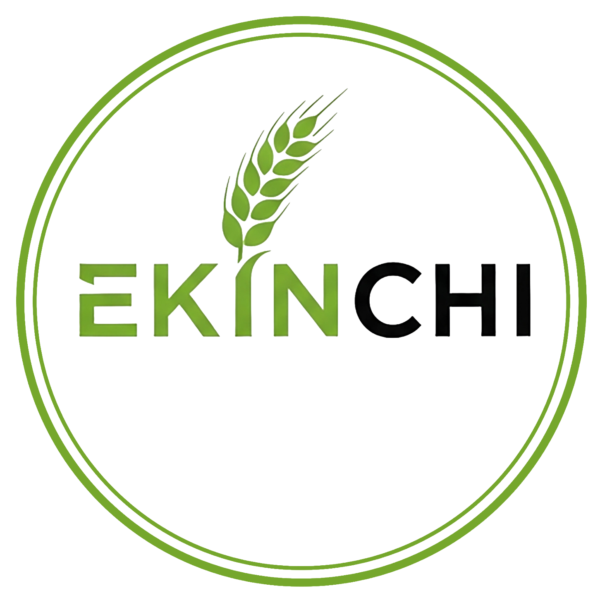

<div align="center">
  

  <h1>🌱 Ekinchi.Az — Rəqəmsal Aqrar Platforma</h1>

  <p>
    <strong>Azərbaycan fermerləri və aqrar biznesləri üçün vahid e-ticarət və təcrübə mübadiləsi ekosistemi.</strong>
  </p>

  <!-- Badges -->
  <p>
    <a href="https://ekinchi.vercel.app" target="_blank">
      
    </a>
    
    
    
  </p>
</div>

<br />

## 🎯 Layihənin Məqsədi (Missiyamız)

**Ekinchi.Az** — kənd təsərrüfatı sektorunda alıcıları, satıcıları, texnika sahiblərini və fərdi fermerləri bir araya gətirən müasir rəqəmsal körpüdür. Məqsədimiz kənd təsərrüfatında rəqəmsallaşmanı sürətləndirmək, məhsulların alqı-satqısını asanlaşdırmaq və fermerlər arasında güclü bir sosial icma yaratmaqdır.

*Torpaqdan süfrəyə, fermerdən fermerə!* 🌾

---

## ✨ Əsas Özəlliklər

Platforma iki əsas istiqamətdə (E-ticarət və Sosial İcma) fəaliyyət göstərir:

<table>
  <tr>
    <td width="50%">
      <h3>🛒 Aqrar Market (Bazar)</h3>
      <ul>
        <li><b>Məhsul Alqı-Satqısı:</b> Meyvə, tərəvəz, dənli bitkilər, toxum və gübrələrin rahat satışı.</li>
        <li><b>Texnika İcarəsi:</b> Traktor, kombayn və digər aqrar texnikaların saatlıq/günlük icarəsi.</li>
        <li><b>İnteraktiv Xəritə:</b> Elanların coğrafi məkana görə tapılması (Leaflet inteqrasiyası).</li>
        <li><b>Detallı Filtrləmə:</b> Kateqoriya, qiymət, region və növə görə ağıllı axtarış.</li>
      </ul>
    </td>
    <td width="50%">
      <h3>🤝 Sosial İcma (Aqro Şəbəkə)</h3>
      <ul>
        <li><b>Təcrübə Paylaşımı:</b> Fermerlərin öz təsərrüfatlarından şəkil və məsləhət paylaşımları.</li>
        <li><b>Sual-Cavab:</b> Ziyanvericilər, suvarma və aqroiqlim barədə müzakirələr.</li>
        <li><b>Qarşılıqlı Əlaqə:</b> Paylaşımları bəyənmə, şərh yazma, yadda saxlama və paylaşma imkanı.</li>
        <li><b>Fermer Profilləri:</b> İzləmə (Follow) sistemi və reytinq xarakterli təsərrüfat profilləri.</li>
      </ul>
    </td>
  </tr>
</table>

---

## 🛠️ Texnologiya Steki (Tech Stack)

Layihə ən müasir və sürətli veb texnologiyalarından istifadə edilərək qurulmuşdur:

*   **Frontend:** `React` (Vite) — Sürətli UI renderinqi üçün.
*   **Stil (Styling):** `Tailwind CSS` — Müasir, responsiv və təmiz dizayn üçün.
*   **Backend / Database:** `Firebase` (Firestore, Auth, Storage) — Real-vaxt məlumat sinxronizasiyası və istifadəçi autentifikasiyası.
*   **İkonlar:** `Lucide React` — Minimalist və yüngül ikon paketi.
*   **Xəritə Sistemi:** `React Leaflet` — Xəritə üzərində elanların dinamik nümayişi.
*   **Routing:** React daxili (Custom context-based) routing.


---

## 🚀 Quraşdırma (Yerli mühitdə başlatmaq)

Layihəni öz kompüterinizdə (localhost) işə salmaq üçün aşağıdakı addımları izləyin:

### 1. Repozitoriyanı klonlayın
```bash
git clone https://github.com/sizin-username/ekinchi.git
cd ekinchi
```

### 2. Asılılıqları yükləyin
```bash
npm install
```

### 3. Firebase Konfiqurasiyası
Layihənin əsas qovluğunda `.env` faylı yaradın və Firebase məlumatlarınızı daxil edin:
```env
VITE_FIREBASE_API_KEY=sizin_api_key
VITE_FIREBASE_AUTH_DOMAIN=sizin_auth_domain
VITE_FIREBASE_PROJECT_ID=sizin_project_id
VITE_FIREBASE_STORAGE_BUCKET=sizin_storage_bucket
VITE_FIREBASE_MESSAGING_SENDER_ID=sizin_sender_id
VITE_FIREBASE_APP_ID=sizin_app_id
```

### 4. Layihəni başladın
```bash
npm run dev
```
Tətbiq standart olaraq `http://localhost:5173` ünvanında açılacaqdır.

---

## 📁 Qovluq Strukturu

```text
ekinchi/
├── public/              # Statik fayllar (robots.txt, sitemap.xml, favicon)
├── src/
│   ├── assets/          # Şəkillər və logolar
│   ├── components/      # Təkrar istifadə edilə bilən UI komponentləri (Navbar, Modal, Card)
│   ├── pages/           # Əsas səhifələr (Home, SocialFeed, Profile və s.)
│   ├── services/        # Firebase və API xidmətləri (apiService, imageService)
│   ├── store/           # Qlobal state menecment (Context & Reducer)
│   ├── App.jsx          # Tətbiqin ana məntiqi və routing
│   └── main.jsx         # Tətbiqin giriş nöqtəsi və ErrorBoundary
├── index.html           # SEO optimizasiyalı əsas HTML faylı
├── tailwind.config.js   # Tailwind fərdiləşdirmələri
└── package.json         # Asılılıqlar
```

---

## 🤝 Töhfə Vermək (Contributing)

Layihəyə töhfə vermək istəyirsinizsə, hər zaman açığıq! 
1. Layihəni **Fork** edin.
2. Yeni bir branch yaradın (`git checkout -b feature/YenilikAdi`).
3. Dəyişikliklərinizi komitləyin (`git commit -m 'Yeni xüsusiyyət əlavə edildi'`).
4. Branch-i push edin (`git push origin feature/YenilikAdi`).
5. **Pull Request** açın.

---

## 📞 Əlaqə & Dəstək

Platforma ilə bağlı hər hansı sualınız, təklifiniz və ya iş birliyi fikriniz varsa bizimlə əlaqə saxlayın:

- 🌐 **Veb-sayt:** [ekinchi.vercel.app](https://ekinchi.vercel.app)
- 📧 **E-poçt:** maylshikhverdiyev@gmail.com

<br />

<div align="center">
  <i>Sevgi ilə və Azərbaycan fermerləri üçün kodlanmışdır ❤️🌱</i>
</div>
